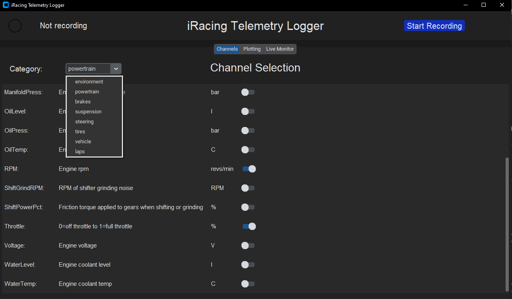
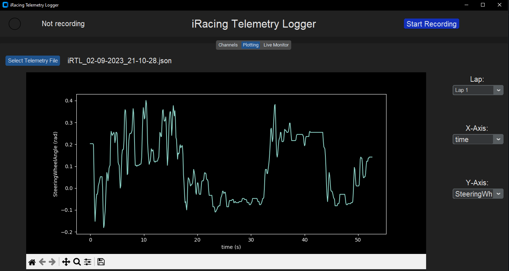
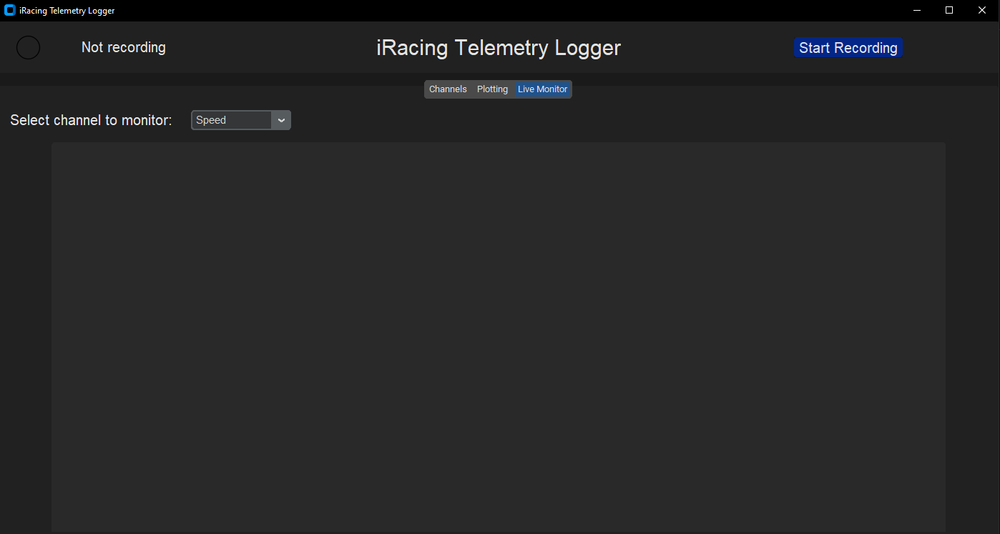

# iRacingDataTool
An app for recording, visualizing, and analyzing iRacing telemetry. The tool can be used to evaluate setups as well as driver performance.

**Before continuing, please note the following:**
- This tool is still in development and will likely have bugs. Please report any bugs you find.
- There is no development schedule for this tool, so updates may be sporadic.
- This tool uses the iRacing SDK and thus requires the iRacing Simulator to be running in order to record data.
- If you have any comments, suggestions, or would like to contribute to the app, please let me know. Improvements are always welcome.

## 1. Setup / Install
1) Install Python 3.10: https://www.python.org/downloads/release/python-31010/ ***(Skip this step if you already have Python installed)***
2) Clone this repo: `git clone https://github.com/KyleWard0525/iRacingDataTool.git`
3) Navigate to the repo directory: `cd <path to iRacingDataTool>`
4) Create a virtual environment: `python -m venv venv`
5) Activate the virtual environment: `.\venv\Scripts\activate`
6) Install required python packages: `pip install -r requirements.txt`

## 2. Running the app

1) In the iRacingDataTool directory, ensure the virtual environment is active: `.\venv\Scripts\activate`
2) Run: `python app.py` 

 

## Features

### Channel Selection 

The Channel Selection tab allows the user to select which channels they would like to record. 

The tool currently supports logging **102 unique channels across 8 different categories** with the ability to add more in the future. 

Once the user has selected the channels they want to record and the iRacing Simulator is running, click the blue `Start Recording` button in the upper-right hand corner to begin recording data.

**NOTE:** Telemetry files will be automatically saved to `data/outputs/iRTL_<month>-<day>-<year>_<hour>-<minute>-<second>.json`, when the users presses the "Stop Recording" button.

### Data Visualization (Plotting tab)

The plotting tab allows users to select a telemetry file and visualize the data they have recorded. The data can be viewed across the entire stint or by lap. 

### Live Monitor

The Live Monitor allows users to select a channel to plot in real-time. 

**NOTE:** In order to plot a channel in the Live Monitor, the channel must be selected in the Channel Selection tab.

- Real-time plot will be displayed in the gray area when the user starts recording

## Roadmap

**NOTE:** This is not a comprehensive list of features that will be added to the tool. This is just a list of features I would like to add at some point in the future.

- [ ] Upload setup file
- [ ] Add support for detecting out/in-laps
- [ ] Find vehicle coordinates on track
- [ ] Add interactive track map that allows the user to view and analyze data at a specific point / section on track
- [ ] Convert data to MoTeC
- [ ] Add post-processing to compute additional channels (will likely require a vehicle setup file)
